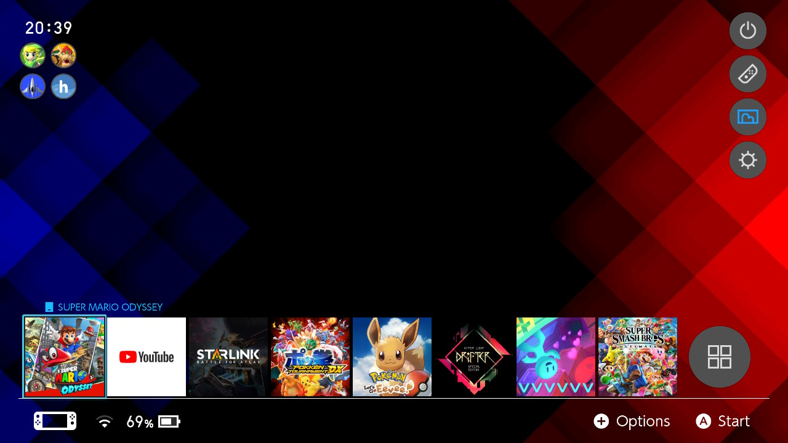

# Theming

You can create unique styles and layouts for your Switch Home Menu.

&nbsp;

!!! tip ""
	

!!! tip "What to follow"
	Follow the `Making a theme` section if you want to make a theme.

	Follow the `Installing a theme` section if you want to install a theme

	Follow the `Installing a custom font` section if you want to install a custom font
	
&nbsp;

## Making a theme (Windows)

### What you need

The latest release of **[Switch Theme Injector](https://github.com/exelix11/SwitchThemeInjector/releases)**

- You need to download the `ReleaseVx.x.zip` on the download page

### Making the theme

1. Unzip `ReleaseVx.x.zip` to somewhere on your pc's drive.
2. Open up the `SwitchThemes.exe` app. Navigate to `NXTheme Builder`.
3. Select a Home menu part, A 720p image and a Layout patch. Click on `Build NXTheme` after selecting your home menu part, image and layout patch.
4. Fill out the details in the window that pops up. After filling out this window and clicking ok, you will get asked where to save the NXTheme file. Save this file to a temporary folder.
5. Repeat step 3 and 4 for every Home Menu part of the Switch you want to modify.

&nbsp;

## Making a theme (Other os's)

###	Converting to DDS:

You will need [GIMP](https://www.gimp.org/) installed, as well as the gimp-dds plugin. On Windows it can be downloaded from [here](https://code.google.com/archive/p/gimp-dds/downloads) and on Linux it should be installed via your package manager. Use your package manager to search for `gimp-dds`. After both of these are installed, you will be able to export your image in the .dds format.

Alternatively, you can use [a dds conversion site](https://www.aconvert.com/image/png-to-dds/) to convert an png image to dds.

### Making the theme

Make sure all of your images you convert are 720P!

1. Navigate to **[Exelix's web injector](https://exelix11.github.io/SwitchThemeInjector/)** and navigate to `Nxtheme builder`
2. Select a Home Menu part you want to edit. After this, select your dds you converted earlier
3. Select a custom layout patch, a theme name and an author name, then click build NxTheme.
4. Repeat step 3 and 4 for every Home Menu part of the Switch you want to modify.
	
&nbsp;

## Installing a theme

!!! tip "Community Themes"
	If you want to use community themes, for example from the **[r/NXTheme Subreddit](https://www.reddit.com/r/NXThemes/)**, you can follow the guide below to install a community provided nxtheme

!!! tip "Homebrew app store"
	If you want to use the homebrew app store for themes, you can simply install the theme you want via the appstore, and follow the instructions from step 2 onwards below.

1. Copy the `.nxtheme` files to the `themes` folder on your sd card (It is recommended you put them into their own folders, e.g. /themes/awesome_theme/awesome.nxtheme)..
	- Create the `themes` folder on the root of your sd card if it does not exist.
&nbsp;
2. Boot Switch CFW, launch the Homebrew Menu and launch `NXThemes Installer`.
3. Your theme files should be listed here. You can install them one by one.
4. Reboot your switch to see the changes.
	
&nbsp;

## Installing a custom font

1. Put a font in the .ttf file format into the `themes` folder (It is recommended you put them into their own folders, e.g. /themes/cool_font/font.ttf).
2. Boot Switch CFW, launch the Homebrew Menu and launch `NXThemes Installer`
3. Find your font and install it
4. Reboot your switch to see the changes.

&nbsp;

## Troubleshooting:
My Switch crashes on boot after I installed a theme!:

- You installed a bad theme. You can remove it by going into the `(CFW)/Titles/0100000000001000/romfs/lyt` and deleting every file in that folder
	
The NXTheme installer crashes when I launch it:
	
- This is probably due to the archive bit being set on either the app or the nxthemes. This is usually the result of copying files to an sd card via a Mac. If you are experiencing this issue, try resetting the archive bit via Hekate for all files.
