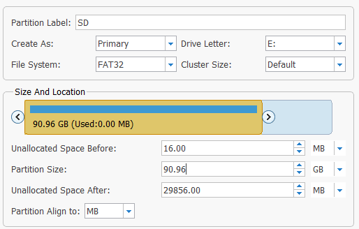
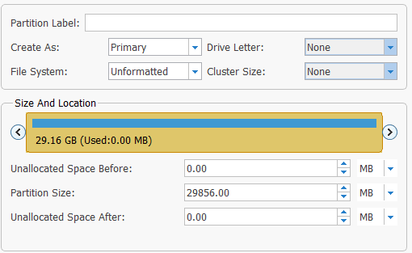

# Partitioning the sd card 

!!!warning "This will delete everything on your sd card"
	Doing this will delete all your data from your sd card, be warned!

!!!danger "Make sure you get the right drive"
	Make sure you pick your SD card while following thse steps, and not some other drive. **if you pick the wrong drive that drive will be deleted instead, be warned!** 

!!! warning "Backing up your existing Nintendo folder"
	Before we start, if you are using a microSD card already as a storage device for your games, you will want to back up your `Nintendo` folder that is on the root of your microSD card to a safe place on your computer. This folder contains your games and saves.

-----

## Windows Instructions

!!!tip "What you need (Windows)"
	- [Minitool partition wizard (or any other good partition manager)](https://www.partitionwizard.com/download/v11/pw11-free.exe)

### Instructions (Windows)

1. Install and open minitool partition wizard
2. Go into the `Disk & Partition Management`
3. Find your SD card and delete the volume on it by right clicking on the partition and pressing delete (This will delete all your data on your sd card!)
4. Create a new partition by right clicking on the unallocated space and then pressing `Create` with the following instructions:
	- Set metrics on the right of `Unallocated Space Before` and `Unallocated Space After` to MB if it's set to GB
	- Set the `File System` to FAT32
	- Set the `Partition Label` to `SD`
	- Set the partition size to `16.00`
	- Set the `Unallocated Space After` to `29872`
	- Drag the left arrow of the partition completely to the left, filling all the space to the left
	- Set the `Unallocated Space Before` to 16 

		

5. Create another new partition with the following settings:
	- Ignore the warning about windows not being able to recognize the partition
	- If it doesn't use the full space yet, make this partition fill the rest of the space
	- Set the file system to `Unformatted`
  

		

6. Your sd card now should look something like this:
   
	

7. Apply the changes to your sd card by hitting apply in the top left

&nbsp;

#### [Continue to SD Preperations <i class="fa fa-arrow-circle-right fa-lg"></i>](sd_preparation.md)

-----
## Linux instructions

!!! danger "SD card identification"
	Make 100% sure you get your microSD card during the following steps. If you are not careful, you can end up wiping your entire linux filesystem. We are not responsible for data loss when doing this.

!!! tip "What you will need (Linux)"
    - The latest version of `gparted`
    - The latest version of `fdisk`
	- Access to an administrator account.

### Instructions (Linux)

1. Open a terminal.
2. Run `sudo fdisk -l`. Enter your password if prompted. This will print information about all drives connected to your computer. Use the information about the file size to identify your microSD card. Specifically, take note of the line after `Disk `. This will look something like `/dev/xxx`, where `xxx` will differ on your system (can also be longer than three characters). It does NOT end with a number.
3. Run `sudo gparted <value>`. Enter your password if prompted. Replace `<value>` in the command with the information you obtained from step 2.
4. You will see a list of partitions on your SD card. Go to `Device` -> `Create partition table`. Select `msdos` as the partition type and select Apply. This will remove all existing partitions from your SD card.
5. Go to `Partition` -> `New`. And do the following:
    - Set `Free space following (MiB)` to `30000`. 
    - Set `Free space preceding (MiB)` to `1`. 
    - Set `File system` to `fat32`. 
    - Set the `Label` to `sMicroSD`. 
    - Leave everything else untouched and select `Add`.

		

1. At the top part of gparted, you will now see a large gray space to the right. Right click this space, select `New`.
2. Set `File system` to `linux-swap`. Set `Label` to `emuMMC`. Leave everything else untouched and select `Add`.
3. Click the check icon in the toolbar.
4.  Wait for all operations to succeed. This might take a while.
5.  Close `gparted`.

!!!info "NOFAT error in Hekate"
	This error might occur after preforming the previous steps if you are using a 64GB microSD. The reason for this is that Hekate expects the FAT32 partition to use a 32k cluster size, which gparted only does by default if the partition is larger than 32GB, which it likely won't be on a 64GB microSD. **This will wipe all the data on your FAT32 partition**.

	To fix this, follow these instructions:

	1. Open a terminal.
	2. Run `sudo fdisk -l`. Enter your password if prompted. This will print information about all drives connected to your computer. Use this information to determine the FAT32 partition on your SD card. Specifically, note the value under the column `Device`. This will look something like `/dev/xxx`, where `xxx` will differ on your system (can also be longer than three characters). It always ends with a number!
	3. Run `sudo mkdosfs <value> -s 64 -F 32 -I`. Enter your password if prompted. Replace `<value>` with the value you got from step 2.
	4. Wait until it finishes running. Depending on the size of your microSD card, this might take a while.
	5. Run `sudo fatlabel <value> "sMicroSD"`. Enter your password if prompted. Replace `<value>` with the value you got from step 2.

#### [Continue to SD Preparations <i class="fa fa-arrow-circle-right fa-lg"></i>](sd_preparation.md)

-----
## macOS instructions

!!! danger "SD card identification"
	Make 100% sure you get your microSD card during the following steps. If you are not careful, you can end up wiping the wrong disk. We are not responsible for data loss when doing this.

!!! tip "What you will need (macOS)"
    - Access to an administrator account.

### Instructions (macOS)

1. Open Terminal at `/Applications/Terminal.app`.
2. Run `diskutil list`. This will print information about all drives connected to your Mac. Use the information about the disk size to identify your microSD card. Use the device name such as `/dev/disk#` when partitioning the microSD card.
3. Run the following command to partition the disk. Ensure that the device name is replaced with the one for your disk.  
`diskutil partitionDisk disk# MBR ms-dos SMICROSD R ms-dos EMUMMC 61124608S`

#### [Continue to SD Preperations <i class="fa fa-arrow-circle-right fa-lg"></i>](sd_preparation.md)
